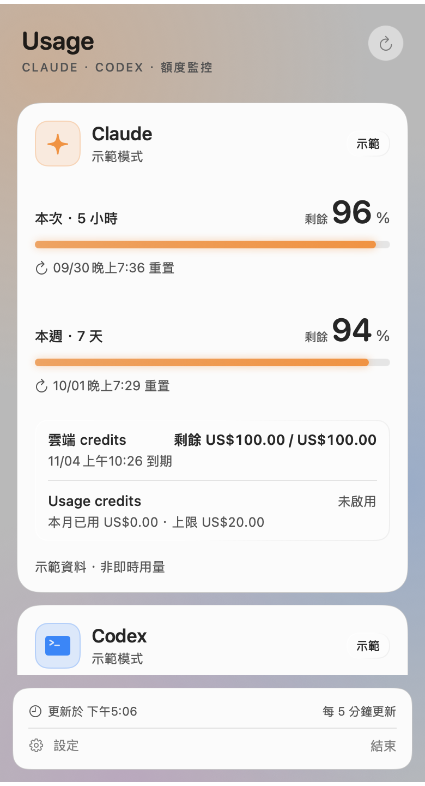
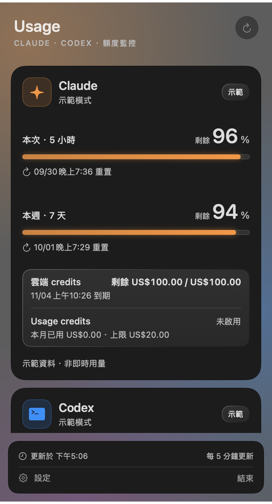

# AI Usage Bar

[English](README.md) · **繁體中文**

Mac 選單列小工具，顯示 **Claude** 與 **Codex**（ChatGPT）訂閱額度還剩多少，不用開瀏覽器。沿用本機 Claude Code 與 Codex CLI 既有的登入，不需要 API key，也不必另外登入。

<p align="center">
  
  
</p>

> 非官方專案，與 Anthropic、OpenAI 無關。

## 功能

- **Claude**：本次（5 小時）、本週剩餘百分比與重置時間；雲端 credits（剩餘、到期）；Usage credits（狀態、本月已用、上限）。
- **Codex**：各額度池的剩餘百分比與重置時間。
- 六種動態選單列圖示可選：跑步貓、火箭、咖啡、心跳、小幽靈、風車。額度用得越多動得越快（開啟「減少動態效果」時靜止）。
- 每 1／5／15 分鐘自動更新；失敗時保留最後成功資料並標示過期，並拉長重試間隔。
- 可選擇剩餘 20%／10% 時通知、登入 Mac 時啟動。
- 外觀：跟隨系統，或只讓這個 App 固定淺色／深色。
- 點卡片上的 Claude／Codex 圖示開啟官方用量頁面。
- 不發送提示詞，不會為了測試而消耗額度。

## 需求

- macOS 13 Ventura 以上（Apple Silicon 或 Intel）
- Claude：已安裝 [Claude Code](https://docs.anthropic.com/en/docs/claude-code) 並以 Claude 訂閱登入（終端機執行 `claude`）
- Codex：已安裝 [Codex CLI](https://github.com/openai/codex) 並以 ChatGPT 訂閱登入（`codex login`）

只用其中一個也可以。

## 安裝

1. 到 [Releases](https://github.com/Yuf91/usagemonitor/releases/latest) 下載 `AIUsageBar-x.y.z.zip` 並解壓縮。
2. 把 **AI Usage Bar.app** 移到「應用程式」資料夾。
3. 這是未經 Apple 公證的版本，第一次開啟會被擋。在 App 上按右鍵 →「打開」→「打開」，或在終端機執行：
   ```sh
   xattr -dr com.apple.quarantine "/Applications/AI Usage Bar.app"
   ```
4. 開啟後選單列會出現一隻貓，點它查看用量；⚙︎ 開啟設定。

## 從原始碼建置

需要 Xcode 或 Command Line Tools（Swift 5.9 以上）。

```sh
git clone https://github.com/Yuf91/usagemonitor.git
cd usagemonitor
bash scripts/build.sh          # 產出 dist/AI Usage Bar.app 與 dist/AIUsageBar-<版本>.zip
```

可用環境變數覆寫：`BUNDLE_ID`、`VERSION`、`BUILD_NUMBER`、`ARCHS`（預設 `"arm64 x86_64"`）。

執行檔（`dist/AI Usage Bar.app/Contents/MacOS/AIUsageBar`）參數：

| 參數 | 用途 |
| --- | --- |
| `--probe` | 唯讀連線檢查，輸出百分比與重置時間，不輸出 token 或帳號 |
| `--self-test` | 資料解析與快照測試 |
| `--preview` | 以明確標示的示範資料啟動，不連線 |
| `--window` | 另外用一般視窗顯示面板 |
| `--render-preview <檔案.png> [--dark] [--settings]` | 以示範資料輸出面板（或設定視窗）截圖 |
| `--render-icons <檔案.png>` | 輸出所有選單列圖示的每一格動畫 |

## 運作方式與隱私

**Claude**：以 `/usr/bin/security` 讀取鑰匙圈中 Claude Code 的登入項目（`Claude Code-credentials`，與 Claude Code 使用相同工具，不會跳出新的授權），再呼叫 `GET https://api.anthropic.com/api/oauth/usage`（Claude Code `/usage` 使用的接口）。token 只在單次請求的記憶體中使用，不儲存、不記錄，也不由本 App 換發；過期時執行 `claude auth status` 讓 Claude Code 自行更新。

**Codex**：啟動 `codex app-server`，呼叫 `account/read` 與 `account/rateLimits/read` 後關閉程序（25 秒逾時），不影響既有 Codex 對話。

**本機儲存**：只有最近一次用量快照與偏好設定（UserDefaults）。除了上述兩家服務，不會傳送任何資料。

## 限制

- 兩個資料來源都**不是公開文件化的 API**，隨時可能變動；未知欄位會隱藏，不會猜測或補零。
- 到了重置時間不會直接顯示 100%，等下一次成功讀取。
- Mac 休眠或 App 關閉時不更新；喚醒後會重新查詢。
- 通知是否出現取決於系統通知權限與專注模式。

測試範圍見 [VALIDATION.md](VALIDATION.md)。

## 貢獻

歡迎開 Issue 或 Pull Request。送出前請執行 `bash scripts/build.sh`（會一併跑自我測試）。

## 授權

[MIT](LICENSE)
